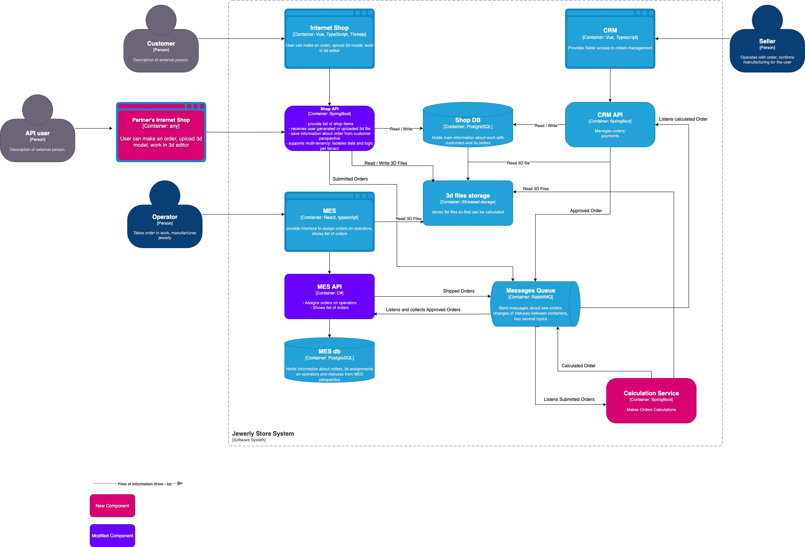

# Потенциальные проблемы 
- Каждый компонент и база данных представлены только одним экземпляром.
В случае сбоя компонента, все флоу блокируется и не способно работать с заказами.
Также нет возможности масштабирования системы в данный момент.
- Неверный компонент выставлен наружу для взаимодействия с партнерскими системами. 
Имеет смысл открыть API основного магазина, который уже ответственен за создание заказа и загрузку 3д документа.
Плюс риск по безопасности, что открывается api внутреннего малозащищенного компонента
- Разные флоу для внутренних заказов через Shop UI и внешних от партнеров 
- Слишком много синхронного взаимодействия, которое может тормозить процессы по заказам.
- MES API не должен быть ответственным за сложные расчеты стоимости 3д модели. 
Для этого лучше выделить расчеты в отдельный компонент, настроить мониторинг, и в случае загрузки автоматически горизонтально скалировать. 
- 3д файлы запрашиваются всеми системами. На некоторых (MES) имеет смысл продумать кеширование на уровне браузера оператора. 
- На данным момент одна база данных используется двумя компонентами. Имеет смысл разделить на каждый компонент по бд.
- Нет модели для поддержания отказоустойчивости флоу. Если на каком-то этапе компонент упадет или передеплоится, заказ потеряется без самовосстановления
- Не раскрыта совсем модель оплаты подсчитанного заказа. Известно только, что в данный момент его подтверждает Seller. 
- Из тестирования указаны только unit tests, что недостаточно для данной системы. 
Необходимо продумать интеграционные тесты на живом или mocked окружении. А также E2E тесты. 

# Инициативы
- Каждый компонент должен быть представлен 2мя экземплярами в проде для отказоустойчивости и релизов без downtime.  
Это же относится к базам данных: каждая база должна иметь reader + writer.
- Перестроение архитектуры в соответствии с новой схемой (6months) с выставлением наружу multitenancy api, выделением 
отдельного компоненты под калькуляцию (он должен масштабироваться автоматически), более четко организованной асинхронной 
архитектурой взаимодействия компонентов по флоу
- Надежная защита внешнего API и проведение тестирования на безопасность 
- Внедрение мониторинга на определенных этапах флоу для возможности самовосстановления компонента 
- Логирование всего флоу для поиска утерянных заказов 
- Внедрить Circuit Breaker для возврата сообщения в очередь в случае перегрузки или падения ответственного компонента
- Разработка подхода по тестированию, максимально использовать автоматизацию
- Добавить кеширование в схему для более быстрого доступа данных, где необходимо 

# Цель на полгода 
На данном этапе я бы выделила 2 основных цели, так как каждая из них достаточно объемная и новая для имеющейся команды разработчиков

## Перестроение архитектуры в соответствии с новой схемой (6months) 
- Shop API должен стать multitenancy api, чтобы принимать заказы не только со стороны внутреннего UI, но и поддерживать аналогичное флоу со стороны партнеров
- Необходимо выделить отдельный сервис для калькуляции стоимости 3д моделей, тк на данный момент это самая длительная и ресурсоемкая процедура. 
Необходимо настроить devops часть таким образом, чтобы в случае образования очереди сообщений или полной загрузки существующих инстансов, поднимались еще экземпляры
- Взаимодействие между компонентами необходимо сделать на очередях. Таким образом, в зависимости от статуса заказа, сообщение будет вычитывать тот или иной компонент

## Каждый компонент и бд должны быть представлены 2мя экземплярами в проде
- Необходимо поднимать по 2 экземпляра каждого компонента, а значит настроить и балансировщик. 
Мониторить состояние экземпляра и поднимать новый, если старый перестал отвечать. 
- На каждую БД также необходимо выделить как минимум по 2 инстанса: один reader и один writer 
- Особая конфигурация должна быть прописана для нового сервиса по калькуляции. Нужно обеспечить его автоматическое масштабирование в зависимости от параметров мониторинга 