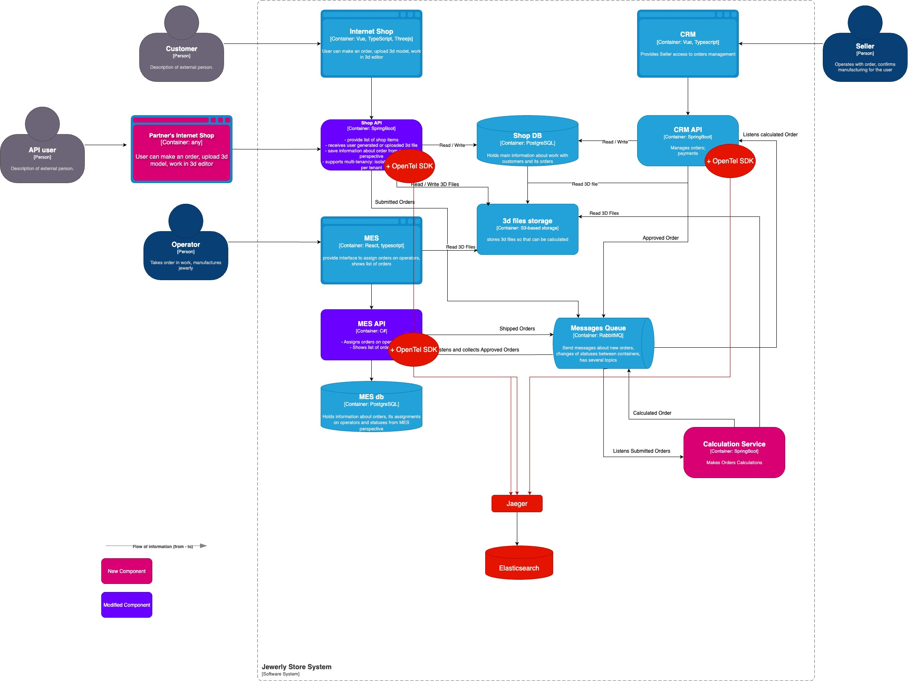

# Мотивация
- Компания уже теряет заказы, некоторые заказы не выполняются несколько месяцев. Это потеря прибыли и существенное влияние на репутацию. 
Трейсинг поможет дев команде найти "проблемное место" значительно быстрее. 
В ряде случаев, без трейсинга будет невозможно идентифицировать проблему и найти решение. 
- Рискованно подключать партнерские системы без возможности в любой момент четко предоставить данные о заказе. 
Это еще дополнительные обязательства перед сторонними компаниями. 
- Трейсинг может помочь улучшить производительность, если команда пойдем, в каких частях флоу происходят задержки. 
Это, как минимум, съэкономленные человекочасы саппорт команды и дев команды. 

На что повлияет: 
1. Бизнес: общее время заказа от создания до доставки клиенту
2. Бизнес: число потерянных, неразрешенных заказов и проблем с ними
3. Техническая: время дев и саппорт команд

# Предлагаемое решение

Нам понадобится внедрить создание трейсов в 3 компонента нашего флоу: 
- Shop API 
- MES API 
- Calculation Service 
Для этого будет использоваться OpenTelemetry SDK (или + OpenTelemetry Collector, если захотим использовать ELK вместо Jaeger).  

Также необходимо поднять в docker-compose Jaeger и настроить необходимые дашборды. 

Список необходимых данных для трейсинга: 
- trace_id
- span_id
- order_id
- tenant_id
- application_name
- environment
- timestamp
- status_code 
- duration

# Компромиссы
В идеальном случае трейсинг должен быть внедрен на всем пути заказа: от момента формирования пользователем до его закрытия после получения клиентом. 
Но в силу множества необходимых изменений в архитектуре приложений и недостатка опыта дев команды в данный момент, можно: 
- покрыть трейсингов наиболее важную часть от момента перехода заказа в состояние Approved 
(когда заказ уже оплачен пользователем, те договор заключен), до его отправки клиенту (Shipped); 
- вместо внедрения полноценного трейсинга использовать order_id в каждом логе любого приложения. Таким образом, при возникновении support case 
с конкретным заказом, будет возможность отыскать быстрее логи именно необходимого заказа. 
- использовать ELK стек для хранения и визуализации трейсов вместе с логами 

# Аспекты безопасности
- Нет необходимости иметь доступ извне, поэтому Jaeger будет доступен только с внутренней сети компании 
- Персональная информация о клиентах, финансовые данные или ключи не должны попадать в трейс 
- Доступ к Jaeger может быть предоставлен по SSO 