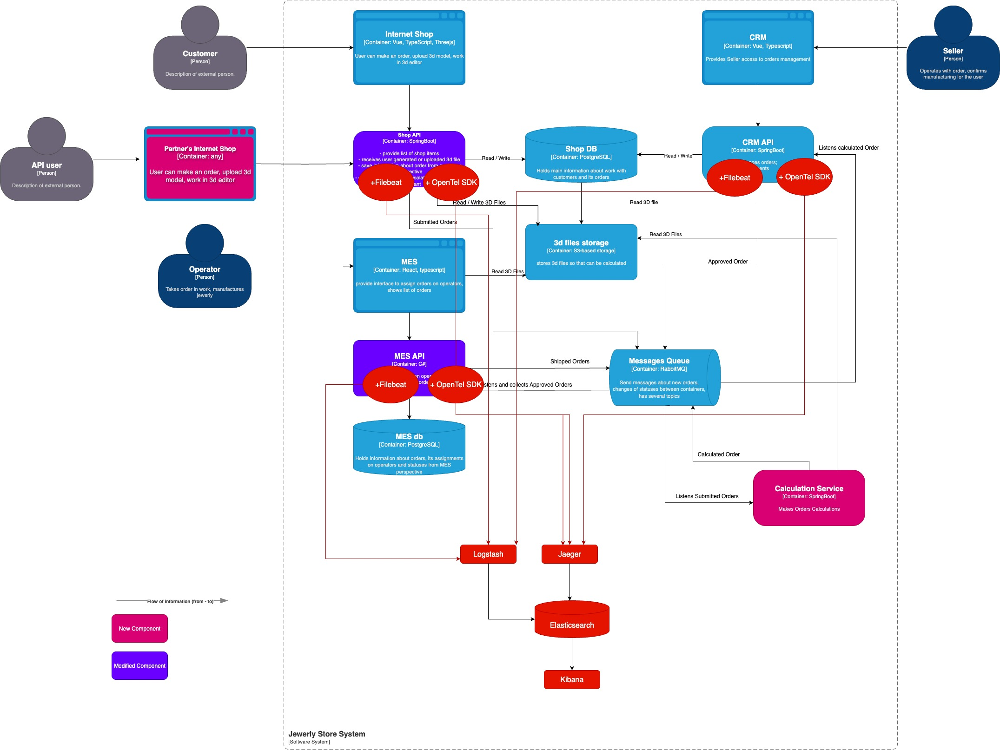

# Мотивация 

- Логирование необходимо, что понимать реально происходящие процессы во флоу. Это полезно как и короткою перспективу, 
когда нужно разобраться с проблемой прямо сейчас, так и на будущее: для дальнейшего расширения системы, для улучшения производительности 
- В силу ограниченности времени имеет смысл внедрить обязательно логирование на "начальную" часть флоу, где происходит 
активное взаимодействие с клиентами системы. В этой части системы происходит много разных манипуляций с личным кабинетом
(данные пользователей, адреса для доставки, платежные данные), а также выбор либо готового изделия (поиск по магазину), 
либо создание собственного дизайна изделия. Т.е. очень много операций на уровне ui-api-db/s3. Здесь можно обойтись без 
трейсов. И тресирование включить уже после того, как заказ был Approved. Т.е. в этот момент уже заказ оплачен и возникает обязательство 
по доставке изделия покупателю, нужно иметь возможность отследить изменения по заказу в разных компонентах системы. Здесь 
трейсинг будет эффективнее. 

На что повлияет: 
1. Техническая: время на разбор инцидента
2. Техническая: количество ошибок в системе 
3. Бизнес: аудит действий пользователя для имплементации улучшений

# Предлагаемое решение

Использовать ELK стек, который хорошо уже зарекомендовал себя. Можно использовать бесплатные возможности Elasticsearch
(если использовать на внутренних серверах) или OpenSearch.

1. Необходимо поднять filebeat для каждого backend приложения (или только для Shop API на первом этапе). Filebeat будет 
считывать log файлы с каждого пода или инстанса и отправлять их в Logstash.
2. Необходимо поднять Logstash, который будет принимать логи со всех имеющихся под / инстансов, обрабытывать их и отправлять 
на хранение в Elasticsearch. 
3. Elasticsearch cluster (в идеале 3 узла для отказоустойчивости). По-идее, уже должен быть после трейсинга. 
4. Поднять и настроить Kibana для визуализации сохраненных логов в Elasticsearch
5. Настроить дашборды и алертинг
6. Тк система сравнительно небольшая, имеет смысл хранить все логи в одном индексе. Это позволит искать информацию 
по ключевым идентификаторам сразу во всех участках флоу.

## Типы логов
- На уровне INFO нужно логировать все requests / response вызванные со стороны ui
  - application, user_id, timestamp, method, endpoint, response_duration, order_id, status_code
- На уровне INFO нужно логировать все получения сообщений из очередей и отправку в очередь
  - application, queue, timestamp, listener, message, order_id
- На уровне INFO нужно логировать все операции по взаимодействию с базой или s3 хранилищем
  - application, timestamp, method, endpoint, duration, order_id, operation_type
- На уровне WARN нужно логировать некорректные действия пользователей или бизнес-ошибки
    - application, user_id, timestamp, method, endpoint, response_duration, order_id, operation_type, status_code
- На уровне ERROR нужно логировать информацию о технических ошибках, о некорректной работе приложения
    - application, user_id, timestamp, method, endpoint, response_duration, order_id, operation_type, error_type, status_code

Альтернативный вариант: использовать уже настроенный ранее OpenTelemetry, который с помощью Collector будет отправлять 
логи напрямую в Elasticsearch. И для визуализации трейсов тоже использовать Кибану вместо Jaeger. Потенциально, это может 
быть быстрее-дешевле, но скорее подойдет для небольших компаний для экономии ресурсов, и чтобы управлять бордами и алертингом 
в одной системе вместо двух. 

## Безопасность
- Нет необходимости иметь доступ извне, поэтому Kibana будет доступен только с внутренней сети компании
- Персональная информация о клиентах, финансовые данные или ключи не должны попадать в логи. Вместо этого, мы можем 
использовать user identifier для привязки процесса к пользователю.
- Доступ к Kibana может быть предоставлен по SSO 

# Система анализа логов 
Kibana отлично поддерживает механизм Alerting. Необходимо проработать наиболее актуальные правила и выбрать канал для 
отправки алерта (email, teams, pagerDuty, slack).
Например, для нашей системы могут быть актуальными правила: 
- приложение получило за час N сообщений, но успешно обработанными залогировано <0,9N
- error rate вырос по сравнению с регулярным значением (например, отвалился коннекшин к базе)
- бизнес-операция завершилась с ошибкой (например, не удалось просчитать стоимость заказа)